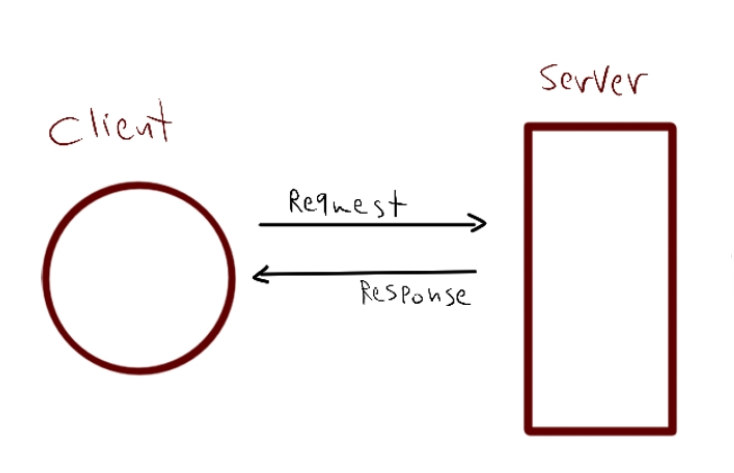

# Lab 02
## basic-express-server
Author: Sham Al-Jalam

* deployed application : [https://server-deployment-practice-oo7v.onrender.com/](https://server-deployment-practice-oo7v.onrender.com/)
[Link text](link URL)


* Github actions: [https://github.com/ShamAhmad2022/server-deployment-practice/actions](https://github.com/ShamAhmad2022/server-deployment-practice/actions)

*  pull request: [https://github.com/ShamAhmad2022/server-deployment-practice/pull/2](https://github.com/ShamAhmad2022/server-deployment-practice/pull/2)

### Setup:
.env requirements:

PORT - 3000

### Running the app:
* npm start

* Endpoint: /

    * Returns Object
    ```Js
    {
        code: 200,
        message: "Welcome to the Home page :)",
        date: "6/14/2023"
    }
    ```

* Endpoint: /person?name=name

    * Returns Object
    ```Js
    {
        name: "name"
    }
    ```


* server errors

    * Returns Object
    ```Js
    {
        code: 500,
        route: "/person?name=234",
        query: {
        name: "234"
        },
        message: "Server ERROR: 234 is a number or empty}"
    }
    ```

* not found pages:

    * Returns Object
    ```Js
    {
        code: 404,
        message: "Page Not Found!",
        route: "/about"
    }
    ```
### Test:
* Unit Test: npm test

### WRRC
